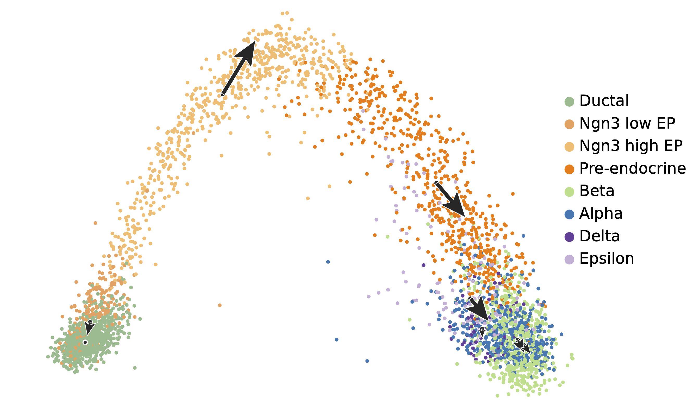

# L-Trail: Estimating macroscopic transition directions in scRNA-seq data via outlier-robust L-moments

[](https://colab.research.google.com/github/jamagiwa/L-Trail/blob/main/tutorials/Pancreas_dataset.ipynb)
[](https://opensource.org/licenses/MIT)

<p align="center">


</p>


**L-Trail** is a statistical toolkit designed to infer the macroscopic transition trends of cell clusters in single-cell RNA sequencing (scRNA-seq) data.

Rather than modeling single-cell kinetics, L-Trail captures the distributional asymmetry ("comet tail") of cell populations within high-dimensional spaces (e.g., PCA) using L-moments. This provides a robust estimation of cluster-level trajectories based purely on static expression states.

## Key Features
* **Macroscopic Trajectory Inference**: Unlike RNA velocity, which models single-cell kinetics, L-Trail focuses on the macroscopic dynamics of cell populations. It infers the directional transition vectors for entire cell clusters based on their spatial distribution.
* **Splicing-Independent**: Because it relies entirely on the geometric asymmetry of the data ("comet tail") rather than mRNA splicing kinetics, L-Trail can be applied directly to standard, static gene expression matrices without the need for unspliced reads.
* **Robustness against Noise**: Single-cell data is inherently sparse and noisy. Instead of conventional Product-moments (e.g., Pearson's skewness) which are susceptible to outliers, L-Trail utilizes L-moments—linear combinations of order statistics. This provides a robust estimation of directional biases, mitigating the impact of technical noise.

## Scope and Limitations
When applying L-Trail, consider the following algorithmic and structural constraints:

* **Geometric Proxy vs. Biological Time**: The inferred directional vectors represent a structural proxy derived from the geometric shape of the data manifold. Unlike RNA velocity, which models a biologically grounded time axis based on transcription and splicing kinetics, L-Trail does not estimate true biological time or physical reaction rates. It strictly captures the macroscopic spatial asymmetry of cell populations.
* **Unidirectional Estimation and the Resolution Trade-off**: Being a cluster-level statistical method, L-Trail infers exactly one macroscopic directional vector per cluster. It cannot intrinsically represent bifurcations or multi-directional branching within a single cell cluster. While applying a finer clustering resolution can approximate complex branching events by breaking them into smaller segments, this introduces a fundamental trade-off: over-clustering reduces the sample size (number of cells) per cluster, which compromises the statistical stability and accuracy of the L-moment estimation.
* **Sample Size Dependency**: As highlighted by the trade-off above, robust L-moment estimation relies on sufficient sample statistics. While a minimum of 30 cells is often used as a practical threshold, small or highly fragmented clusters may produce unreliable and volatile directional vectors.
* **Linearity Constraint**: Because L-Trail computes directional vectors using linear combinations of moments, the inferred trajectory for a cluster is strictly a linear, straight vector. It cannot model non-linear curved trajectories within a single cluster. Consequently, calculations must be performed exclusively within a linear high-dimensional space (e.g., top 30 principal components). Computing vectors directly within non-linear embeddings (e.g., UMAP or t-SNE) introduces severe spatial distortions and is mathematically invalid.
* **Continuous Manifold Assumption**: The geometric inference assumes the presence of an underlying continuous data manifold. The algorithm estimates macroscopic trends within connected, progressing populations and cannot infer developmental trajectories across discrete or disconnected cell states.

## Installation

Currently, L-Trail can be installed by cloning this repository.

```bash
git clone https://github.com/jamagiwa/L-Trail.git
cd L-Trail
pip install -r requirements.txt
```

## Dependencies
* Python >= 3.8
* `numpy`, `pandas`, `scipy`, `scikit-learn`, `scanpy`, `anndata`, `scvelo`, `leidenalg`, `igraph`, `matplotlib`, `scikit-misc`


## Quick Start & Tutorial
We provide a Jupyter Notebook to demonstrate the basic usage of L-Trail, from data preprocessing to trajectory inference and visualization.
* [Interactive Colab Tutorial](https://colab.research.google.com/github/jamagiwa/L-Trail/blob/main/tutorials/Pancreas_dataset.ipynb): You can run the demonstration of the Pancreas dataset directly in your browser without any local setup.

Basic Usage Example
```python
import scanpy as sc
import sys
# Adjust to your cloned directory
sys.path.append('/path/to/L-Trail') 
from ltrail import tl, pl

# Load your AnnData object (assuming standard preprocessing and PCA/UMAP are already computed)
adata = sc.read_h5ad("your_data.h5ad")

# Calculate L-Trail similarities in high-dimensional space
df_results = tl.calc_knn_similarity(
    adata=adata,
    groupby='clusters',
    use_rep='X_pca',
    method='lmoment'
)

# Visualize vectors on embeddings
pl.plot_ltrail(
    adata,
    groupby='clusters',
    basis='X_umap',
    use_rep='X_pca',
    method='lmoment'
)
```

## Repository Structure
* `ltrail/tl.py`: Core algorithms for L-moment computation and vector estimation.

* `ltrail/pl.py`: Functions for visualizing L-Trail vectors on 2D embeddings (e.g., PCA, UMAP).

## Citation
A manuscript describing L-Trail is currently in preparation. In the meantime, if you use this tool in your research, please cite this GitHub repository:

> Yamagiwa, T. (2026). L-Trail: Estimating macroscopic transition directions in scRNA-seq data via outlier-robust L-moments. GitHub repository. https://github.com/jamagiwa/L-Trail
> 
## Licence
This project is licensed under the MIT License - see the LICENSE file for details.
